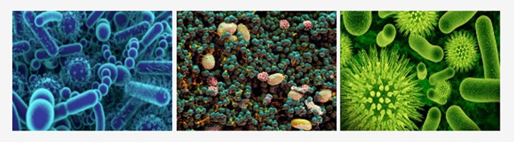

# Belly Button Biodiversity

# Dashboard
<a href="https://nicolebusta.github.io/BellyButtonBiodiversity/" target_="blank"> Belly Button Biodiversity Dashboard </a>

# Background
The purpose of this project is to create an interactive dashboard to explore the <a href="http://robdunnlab.com/projects/belly-button-biodiversity/" rel="nofollow" target_="blank">Belly Button Biodiversity Dataset</a>, which catalogs the microbes that colonize human navels.

The dataset reveals that a small handful of microbial species (also called operational taxonomic units, or OTUs, in the study) were present in more than 70% of people, while the rest were relatively rare.

# Results
The following visualizations were created from the dataset; these can be further explored by visiting the dashboard referenced above:
<li> Test Subject ID No - <i>drop down menu for test subject selection </i></li>
<li> Demographic Info - <i>metadata containing details of test subject </i></li>
<li> Top 10 OTUs Present - <i>bar chart, includes hovertext of bacteria details </i></li>
<li> Belly Button Washing Frequency - <i>guage chart plotting weekly washing </i></li>
<li> Bubble Chart - <i>bubble radius reflects size of sample values </i></li>
 

# Resources
#### <b>Data Source:</b> samples.json
#### <b>Software/Tools:</b> JavaScript, VSCode, HTML, CSS, Chrome DevTool
